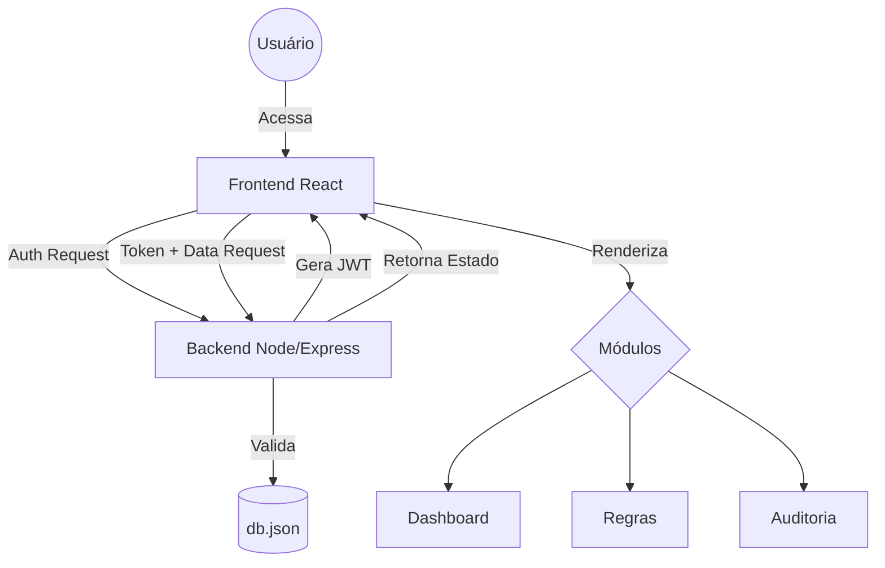

# Arquitetura do Sistema - BRMS-FGV

O BRMS-FGV utiliza uma arquitetura Monolítica Modular voltada para web, priorizando performance no frontend e simplicidade no backend.

## Stack Tecnológica
- **Frontend**: React 19, Vite, Tailwind CSS, Lucide React (Ícones).
- **Backend**: Node.js, Express, JWT (Autenticação), Bcrypt (Segurança).
- **Persistência**: JSON Flat-File (`db.json`).

## Fluxo da Aplicação

## Estrutura de Segurança (RBAC)
A segurança é implementada em duas camadas:
1. **Frontend**: O componente `Sidebar.jsx` e `App.jsx` filtram os menus com base nas permissões do token.
2. **Backend**: Middleware de autenticação valida o JWT em cada requisição de dados ou salvamento.

## Integração entre Módulos
O `App.jsx` atua como o **Orquestrador de Estado Central**. Toda mudança em uma regra ou usuário dispara uma atualização no estado global, que é sincronizado via API `/api/save`.

## Monitoramento em Background
Um serviço de monitoramento (`monitoringService.js`) roda continuamente no frontend, verificando expiração de regras e detectando conflitos lógicos sem necessidade de recarregar a página.
